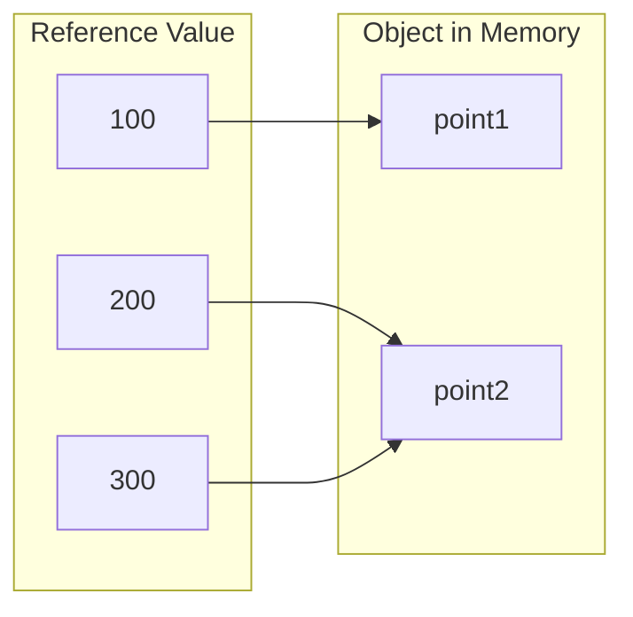

# Primitive Type

Primitive are a foundation of data type to represent simple values.

| Type    | Size (bits) | Min Value          | Max Value                            | Example              |
|---------|-------------|--------------------|--------------------------------------|----------------------|
| boolean | 1           | -                  | -                                    | `boolean b = true;`  |
| char    | 16          | 0                  | 2<sup>16</sup>-1                     | `char a = 'a';`      |
| byte    | 8           | -2<sup>7</sup>     | 2<sup>7</sup>-1                      | `byte by = 100;`     |
| short   | 16          | -2<sup>15</sup>    | 2<sup>15</sup>-1                     | `short number = 3;`  |
| int     | 32          | -2<sup>31</sup>    | 2<sup>31</sup>-1                     | `int number = 4;`    |
| long    | 64          | -2<sup>63</sup>    | 2<sup>63</sup>-1                     | `long l = 99L;`      |
| float   | 32          | -2<sup>-149</sup>  | (2-2<sup>-23</sup>).2<sup>127</sup>  | `float f = 1.2345F;` |
| double  | 64          | -2<sup>-1074</sup> | (2-2<sup>-52</sup>).2<sup>1023</sup> | `double d = 3.14;`   |

# Reference Type

Any non primitive type, including class, interface, array types.
These type contain a reference to the actual data, unlike primitive type that contain the actual data value.

Example:
```java
Point point1 = new Point(); // let say point1 stored as ref number 100, that refer to point1 object
Point point2 = new Point(); // let say point2 stored as ref number 200, that refer to point2 object
Point point3 = point2;      // let say point3 stored as ref number 300, when assigned it will refer to point2 object
```

Below will be the diagram on how the reference point to the object


Above mean that updating `point3` variables will actually update object created of `point2`. 